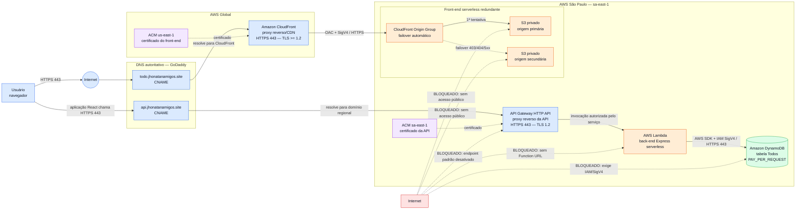

# Diagrama técnico — To-Do App serverless

Arquitetura efetivamente implantada na AWS. Os recursos regionais ficam em São
Paulo (`sa-east-1`); o CloudFront é global e, por exigência desse serviço, seu
certificado ACM fica em N. Virginia (`us-east-1`).

## Portas, protocolos e controles

| Origem | Destino | Porta/protocolo | Decisão | Controle aplicado |
| --- | --- | --- | --- | --- |
| Navegador | CloudFront | TCP 443 / HTTPS | Permitido | Certificado ACM, redirecionamento HTTP→HTTPS, TLS mínimo 1.2 e cabeçalhos de segurança |
| CloudFront | S3 primário/secundário | HTTPS / SigV4 | Permitido | Origin Access Control (OAC) limitado à distribuição |
| Navegador/front-end | API Gateway | TCP 443 / HTTPS | Permitido | Domínio próprio, CORS restrito e throttling |
| API Gateway | Lambda | Invocação de serviço AWS | Permitido | Permissão IAM específica; sem acesso direto à função |
| Lambda | DynamoDB | TCP 443 / API AWS SigV4 | Permitido | Role de mínimo privilégio limitada à tabela do projeto |
| Internet | Buckets S3 | HTTP/HTTPS direto | Bloqueado | S3 Block Public Access e política que exige transporte seguro |
| Internet | Lambda | Acesso direto | Bloqueado | Function URL inexistente |
| Internet | DynamoDB | Requisição não autenticada | Bloqueado | Serviço exige credenciais IAM e assinatura SigV4 |
| Internet | Endpoint padrão da API | HTTPS | Bloqueado | `DisableExecuteApiEndpoint = true` |

## Redundância implementada

O build React é publicado em dois buckets S3 privados. O CloudFront usa um
`Origin Group`: consulta primeiro o bucket primário e muda automaticamente para o
secundário quando recebe `403`, `404`, `500`, `502`, `503` ou `504`. O teste com
`failover-probe.txt`, presente apenas no bucket secundário, confirmou o caminho de
failover.
